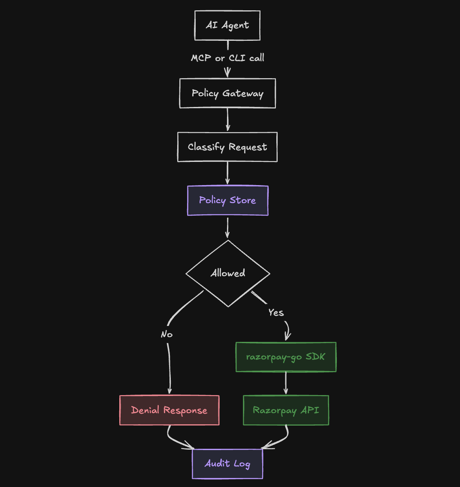

# mandate

A deterministic, LLM-free policy gateway that governs what an AI agent is allowed to spend through Razorpay's recurring payment APIs, enforced at the HTTP transport layer against the unmodified `razorpay-go` SDK.

## Why this exists

RBI Circular RBI/DPSS/2026-27/396 ("Digital Payments, E-mandate Framework, 2026") sets a uniform, network-wide, per-transaction AFA threshold: recurring debits up to 15,000 rupees may process without additional factor authentication. That threshold is identical for every mandate, every merchant, and every agent. It gives a merchant no way to impose a tighter, agent-specific, cumulative, or category-based spend limit on top of a mandate they have already granted. See `docs/VERIFIED_POINTERS.md` for the full sourced citation.

No policy engine exists in `razorpay-go`, `razorpay-mcp-server`, or `razorpay-cli`. Confirmed directly against their source: `razorpay-go` is a thin HTTP client wrapper with no request inspection, `razorpay-mcp-server`'s toolset (`pkg/razorpay/tools.go`) wraps SDK calls with no cap or category logic, and `razorpay-cli` manages resources and automates workflows with no spend governance layer. Nothing between an agent and Razorpay's network currently enforces a per-agent, per-category, or cumulative limit.

This project is that layer.


*Figure: an AI agent reaches the policy gateway, which classifies the request and checks it against the policy store; denied requests return a denial response directly, allowed requests go through the razorpay-go SDK to the Razorpay API, and both paths are recorded in the audit log.*

## What this proves

Every number below is a real, reproducible result already produced in this repository. None are estimates.

### Concurrency safety at a single policy

`internal/store/policy_store_concurrency_test.go`, `TestPolicyStore_Concurrency`: 500 concurrent goroutines against one policy, cumulative cap 100,000 paise, 1,000 paise per debit.

```
Successes: 100, Denies: 400, Errors: 0
```

Verified against the real `debit_ledger` row count and sum, not just in-process counters. The cap ratio, not a coincidence.

### Throughput across independently capped agents

`test/integration/multi_agent_load_test.go`, `TestMultiAgent_LoadWithRealThroughput` (full record in `docs/adr/0006_multi_agent_scoping.md`): 6 agents, each with its own cumulative cap, 630 total concurrent attempts.

```
agents=6 total_attempts=630 elapsed=1.85s throughput=341.1 req/s
total_successful_debits=210 (expected 210) total_denied=420
  agent[0] cap_paise=10000 attempts=30  successes=10/10 denials=20
  agent[1] cap_paise=20000 attempts=60  successes=20/20 denials=40
  agent[2] cap_paise=30000 attempts=90  successes=30/30 denials=60
  agent[3] cap_paise=40000 attempts=120 successes=40/40 denials=80
  agent[4] cap_paise=50000 attempts=150 successes=50/50 denials=100
  agent[5] cap_paise=60000 attempts=180 successes=60/60 denials=120
```

Every agent's successes matched its cap exactly. Zero cap overshoot. Zero cross-agent ledger or audit contamination.

### Gateway decision-overhead latency

`test/integration/gateway_latency_benchmark_test.go`, full record and interpretation in `docs/PERFORMANCE.md`:

| Population | Sample size | p50 | p95 | p99 |
|---|---|---|---|---|
| Denied (sequential) | 1000 | 1.168459ms | 2.558834ms | 4.715833ms |
| Allowed (sequential) | 1000 | 3.492542ms | 4.484917ms | 7.307417ms |
| Denied (concurrent) | 300 | 442.625375ms | 490.992791ms | 497.194375ms |
| Allowed (concurrent) | 300 | 1.241788458s | 1.72031175s | 1.863358834s |

The 300-concurrent rows are a deliberate worst-case single-policy lock contention test, not a representative throughput number. See `docs/PERFORMANCE.md` for why 341.1 req/s above is the representative concurrent-usage figure instead.

### A real bug, found live and fixed, in the audit trail itself

These five rows are the actual `audit_log` table, queried directly from Postgres, not copied from a prior session transcript.

| id | entry_type | agent_id | category | reason | decision | created_at |
|---|---|---|---|---|---|---|
| 2803 | intent | agent_final_rehearsal | debit_execution | ok | allowed | 2026-09-05 13:14:43 |
| 2804 | outcome | agent_final_rehearsal | debit_execution | http_200 | allowed | 2026-09-05 13:14:45 |
| 2805 | resolution | (empty) | (empty) | stuck_unauthorized | allowed | 2026-09-05 13:14:50 |
| 2809 | outcome | agent_final_rehearsal | debit_execution | http_200 | allowed | 2026-09-05 13:29:33 |
| 2810 | resolution | agent_final_rehearsal | debit_execution | stuck_unauthorized | allowed | 2026-09-05 13:29:38 |

Row 2805 is the bug: a resolution entry with no `agent_id` and no `category`, written by `internal/mandate.logDebitResolution` before it hardcoded the category and before the MCP tool handler resolved an effective agent identity ahead of calling `ExecuteMandateDebit`. Row 2810 is the same code path, minutes later, after both fixes: `agent_id` and `category` are populated. The seven audit-log rows that predate this fix keep their empty fields. They were not backfilled, on the same principle the audit chain itself enforces: a written entry is never edited after the fact.

## Quickstart

Build every binary:

```bash
go build ./...
```

Bring up Postgres and apply every migration:

```bash
docker compose up mandate-postgres-docker migrate
```

Propose a policy in plain text, then activate it:

```bash
mandate-cli propose policy_demo agent_demo "Allow recurring debits, category debit_execution, up to 500 rupees per transaction, with a cumulative cap of 2000 rupees per day, capped at 10 calls, expiring on 2026-12-31."
mandate-cli confirm <proposal_id printed above>
```

Run the transport-layer gateway (also the MCP server; see `docs/adr/0007_mcp_composition.md`):

```bash
mandate-gateway
```

Verify the audit chain is intact:

```bash
mandate-verify
```

## Documentation

- `AGENTS.md`, build, test, and lint commands, and conventions for any agent working in this repository.
- `docs/ARCHITECTURE.md`, system diagrams and a summary of what each package owns.
- `docs/THREAT_MODEL.md`, what this project protects against and what it explicitly does not.
- `docs/PERFORMANCE.md`, the full latency benchmark and the real historical concurrency numbers.
- `docs/VERIFIED_POINTERS.md`, the sourced RBI regulatory citation this project's premise rests on.
- `docs/MANUAL_TEST_STEPS.md`, the one part of the test suite that requires a human in a browser, and why.
- `docs/adr/`, every architecture decision record, in order, with the reasoning and the live evidence behind each one.

## License

There is no license file in this repository yet.
