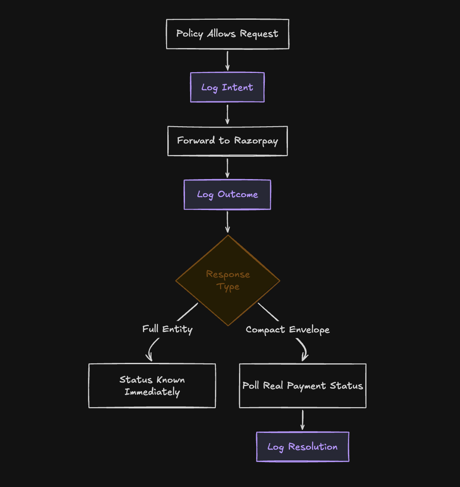

# Architecture

## System diagram

*Figure: an AI agent reaches the policy gateway, which classifies the request and checks it against the policy store; denied requests return a denial response directly, allowed requests go through the razorpay-go SDK to the Razorpay API, and both paths are recorded in the audit log.*

## Audit trail diagram

*Figure: once a policy allows a request, intent is logged, the request is forwarded to Razorpay, and the outcome is logged; if the response is a compact envelope rather than a full entity, real payment status is polled before a final resolution is logged.*

## Packages

### internal/policy

Owns `Evaluate`, the pure decision function that checks amount, expiry, category, and per-debit cap in memory before ever touching a store. Owns the `Policy`, `DebitRequest`, and `Decision` types, the `Store` and `PolicyResolver` interfaces, and the sentinel errors that distinguish a policy denial from a system failure. Also owns `ProposePolicy`, the natural-language parser that turns free text into a `Policy` value with no database handle in its signature at all.

### internal/gateway

Owns the transport-layer enforcement point. `Classify` maps a raw `*http.Request` to one of five categories: `registration`, `debit_execution`, `read_only`, `order_creation`, or `customer_lookup`, denying anything it does not recognize by default. `PolicyRoundTripper` wraps an `http.RoundTripper`, resolves the caller's policy by `agent_id`, calls `policy.Evaluate`, and returns a synthetic response on denial without ever touching the network.

### internal/audit

Owns the hash-chained, tamper-evident decision log. Every entry's `Hash` covers its own `PrevHash` and `Payload`, so `Verify` can walk the whole chain and detect any single-entry mutation. Four entry types: `intent`, `outcome`, `resolved` (a denial, which never reaches the wire), and `resolution` (a debit's true final state, known only after out-of-band polling `PolicyRoundTripper` cannot see). `Store` has a Postgres implementation and an in-memory fake for tests.

### internal/mandate

Owns the actual calls against Razorpay: creating a registration link, polling for a newly confirmed token, fetching a token's status, and executing a recurring debit. `ExecuteMandateDebit` includes the compact-envelope capture-verification polling that determines whether a debit actually captured, stayed authorized but uncaptured, or never progressed past created. Has no dependency on `internal/gateway` or `internal/policy`, and no way to reach a database directly.

### internal/mcpserver

Owns the MCP composition. Registers `fetch_tokens` from the official `razorpay-mcp-server` toolset, plus two custom tools, `mandate_execute_debit` and `mandate_create_registration_link`, that wrap `internal/mandate`'s functions directly. All three share one `*razorpay.Client` whose transport is the same `PolicyRoundTripper` every other caller uses. Does not construct its own transport or bypass the gate in any way.

## Architecture decision records

| ADR | Decided |
|---|---|
| `0001_cumulative_cap_ledger_vs_counter.md` | An append-only `debit_ledger`, not a running counter, for genuine sliding-window semantics and one source of truth shared with the audit log. |
| `0002_idempotency_locking_and_error_semantics.md` | A per-policy Postgres advisory lock guards the cap check, `Evaluate` returns a strict three-way allow, deny, or system-error contract, and `request_id` makes a retried debit idempotent. |
| `0003_registration_link_auth.md` | Replaced the blocked card S2S authorization path with Razorpay Registration Links, root-caused the debit endpoint's failure to an account mode setting, and later closed the remaining debit-authorization question against Razorpay's own documented settlement window. |
| `0004_transport_layer_gateway.md` | Built `PolicyRoundTripper` around the unmodified `razorpay-go` client, with a fail-closed classifier and named passthrough categories for calls that cannot move money by themselves. |
| `0005_audit_trail.md` | Added the hash-chained audit log, its intent, outcome, resolved, and resolution entry types, and stated its exact tamper-evidence boundary explicitly. |
| `0006_multi_agent_scoping.md` | Replaced a single policy loaded once at boot with per-request policy resolution by `agent_id`, proven isolated under concurrent load from independent agents. |
| `0007_mcp_composition.md` | Composed the official `razorpay-mcp-server` MCP toolset with two custom tools wrapping `internal/mandate` directly, after confirming live that the official debit tool does not work for this account's recurring-debit case. |
